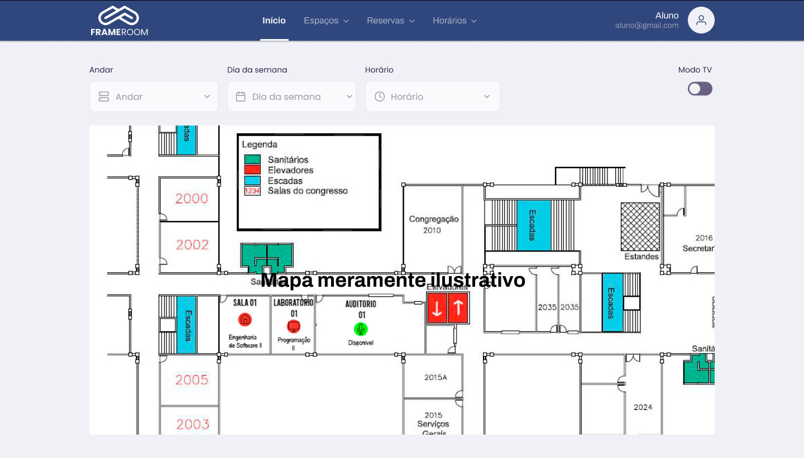
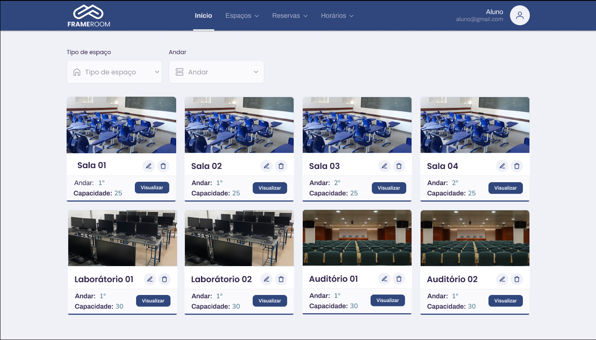
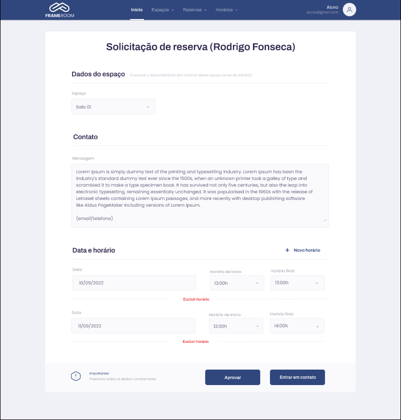

# Frameroom

## 📝 Sobre

**Frameroom** é uma aplicação para controle de espaços/horarios e gerenciamento de solicitações de reserva de espaço.

A aplicação está sendo desenvolvida para o Predio CCET da Universidade Estadual de Montes (Unimontes), no formato Web.

Para visualizar no FIGMA, clique aqui:  [FIGMA](https://www.figma.com/file/9CUhWoIodEfrkombF5FmWK/Layout-Frameroom?node-id=0%3A1)

 

## 🖥️ Demonstração

<h1>
    
    
    
    
</h1> 
  

 

## 🚀 Tecnologias e ferramentas utilizadas

- **React**
- **TypeScript**
- **Styled-components**
- **Yup**
- **Axios**

- **Node**
- **API REST**
- **Express**
- **PostgresSQL**
- **Docker**
- **TypeORM**
- **Migrations**
- **Autenticação JWT**

-**Teste automatizados: Jest**

 

## 🏛️ Arquitetura

- **DDD(Domain Driven Design)**
- **TDD(Test Driven Development)**
- **Principios do SOLID**

-**Teste automatizados: Jest**

 

